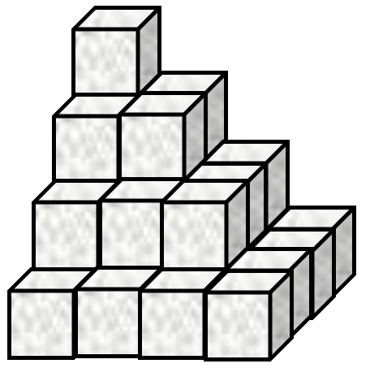
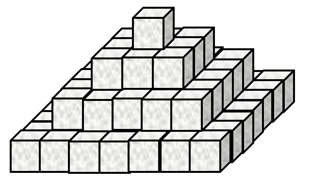
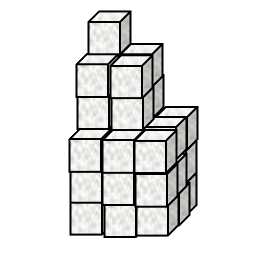
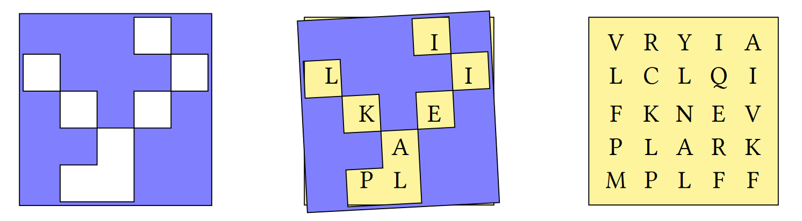

# Answers

## Problem Set 1
1.   
	The average daily temperatures, in degrees Celcius, for 7 days are stored in a variable `t_allweek`.
	
	```APL
	t_allweek ← 11.7 8.6 9.7 14.2 6.7 11.8 9.2
	```
	
	Use APL to compute the follwing:
	
	1. The highest daily temperature
	1. The lowest daily temperature
	1. The range of (difference between the largest and the smallest) temperatures
	1. Each temperature rounded to the nearest whole number

	??? Example "Answers"
		<ol type="a">
		<li>
		```APL
		      ⌈/t_allweek
		14.2
		```
		</li>
		<li>
		```APL
		      ⌊/t_allweek
		6.7
		```
		</li>
		<li>
		```APL
		      (⌈/t_allweek)-⌊/t_allweek
		7.5
		```
		
		> You may have found the correct answer using the following expression:
		```APL
		      ⌈/t_allweek-⌊/t_allweek
		7.5
		```
		
		> but this is less efficient because it does more subtractions than it needs to. Recall the right-to-left evaluation:
		```APL
		      ⌈/      t_allweek                 - ⌊/ t_allweek
		      ⌈/      t_allweek                 - 6.7
		      ⌈/ 11.7 8.6 9.7 14.2 6.7 11.8 9.2 - 6.7
		      ⌈/ 5 1.9 3 7.5 0 5.1 2.5
		      7.5
		```
		
		> if we use parentheses `()` to force APL to compute the maximum of the list before doing subtraction, we only do a single subtraction instead of 7:
		```APL
		      ( ⌈/t_allweek ) - ⌊/ t_allweek
		      ( ⌈/t_allweek ) - 6.7
		      (     14.2    ) - 6.7
		      7.5
		```
		
		</li>
		<li>
		To round to the nearest whole number, either add 0.5 and round down:
		```APL
		      ⌊0.5+t_allweek
		12 9 10 14 7 12 9
		```
		
		or subtract 0.5 and round up:
		```APL
		      ⌈t_allweek-0.5
		12 9 10 14 7 12 9
		```
		</li>
		</ol>

1. A Mathematical Notation

	Use APL to evaluate the following

	1. $\prod_{n=1}^{12} n$ (multiply together the first twelve integers)

	1. $\sum_{n=1}^{17}n^2$ (add together the first seventeen squared integers)

	1. $\sum_{n=1}^{100}2n$ (add together the first one hundred positive even integers)

	1. $\sum_{n=1}^{100}2n-1$ (add together the first one hundred odd integers)

	1. In TMN, the following expression is equal to `0`, why does the following return `70` in APL?
		```APL
		      84 - 12 - 1 - 13 - 28 - 9 - 6 - 15  
		```
		```
		70
		```

*[TMN]: Traditional Mathematical Notation

	??? Example "Answers"
		<ol type="a">
		<li>
		```APL
		      ×/⍳12
        479001600
		```
		</li>
		<li>
		```APL
		      +/(⍳17)*2
        1785
		```
		Without parentheses we get the sum of the first 289 integers, instead of the first 17 integers squared.

		|TMN|APL|
		|---|---|
		|$\sum_n^{17^2} n$|`+/⍳17*2`
		|$\sum_n^{17} n^2$|`+/(⍳17)*2`|

		</li>
		<li>
		```APL
		      +/2×⍳100
        10100
		```
		</li>
		<li>
		We can either subtract 1 from the even numbers:
		```APL
		      +/(2×⍳100)-1
		10000
		```

		or we can add negative 1:
		```APL
		      +/¯1+2×⍳100
        10000
		```
		The high minus denotes a literal negative, whereas the hyphen indicates subtraction.
		</li>
		<li>
		Remember the right-to-left rule: functions take everything to their right, and the first thing to their left. We can add unnecessary parentheses to show how APL evaluates our expression.
		```APL
		      (84 - (12 - (1 - (13 - (28 - (9 - (6 - 15)))))))
	    70
		```
		</li>
		</ol>

1. Pyramid Schemes
	1. Sugar cubes are stacked in an arrangement as shown by **Figure 1**.

		
			<figcaption><strong>Figure 1.</strong> Stacked sugar cubes</figcaption>

		This stack has `4` **layers** and a total of `30` cubes. How many cubes are there in a similar stack with `467` **layers**?

	1. Now consider the stack in **Figure 2**.

		
			<figcaption><strong>Figure 2.</strong> Differently stacked sugar cubes</figcaption>

		The arrangement in **Figure 2** has `4` **layers** and `84` cubes. How many cubes are there in a similar stack with `812` **layers**?

	1. Now look at **Figure 3**.

		
			<figcaption><strong>Figure 3. </strong>This is just a waste of sugar cubes by now...</figcaption>

		The stack in **Figure 3** has `3` **"layers"** and `36` cubes in total. How many cubes are there in a similar stack with `68` **"layers"**?

	???Example "Answers"
		<ol type="a">
		<li>
		Each $n$th layer has $n^2$ cubes. There are $34,058,310$ cubes in a stack with $467$ layers.
		```APL
			+/(⍳4)*2
		```
		```
		30
		```
		---
		```APL
			+/(⍳467)*2
		```
		```
		34058310
		```
		</li>
		<li>
		Each $n$th layer has $(2n-1)^2$ cubes. There are $713,849,500$ cubes in a stack with $812$ layers.
		```APL
			+/(¯1+2×⍳4)*2
		```
		```
		84
		```
		---
		```APL
			+/(¯1+2×⍳812)*2
		```
		```
		713849500
		```
		</li>
		<li>
		Each $n$th layer has $n^3$ cubes. There are $5,503,716$ cubes in a stack with $68$ layers.
		```APL
			+/(⍳3)*3
		```
		```
		36
		```
		---
		```APL
			+/(⍳68)*3
		```
		```
		5503716
		```
		</li>
		</ol>

1. Rewrite the following expressions so that they do not use parentheses.
	1. `(÷a)×b`
	1. `(÷a)÷b`
	1. `(a+b)-5`
	1. `(a+b)+5`

	???Example "Answers"
		<ol type="a">
		<li>Multiplication is commutative, which means that the order of arguments does not matter, so we can write `b×÷a`. Even more simply, it is `b÷a` because multiplication by a reciprocal is the same as division.</li>
		<li>${{{1}\over{a}}\div{b}} = {{1}\over{a\times{b}}}$ so we can write `÷a×b`</li>
		<li>Use a literal negative five:`¯5+a+b`</li>
		<li>No parentheses needed: `a+b+5`</li>
		</ol>


## Problem set 2
The following problems can be solved with single-line dfns.

1. Eggs

	A recipe serving 4 people uses 3 eggs. Write the function `Eggs` which computes the number of eggs which need cracking to serve `⍵` people. Using a fraction of an egg requires that a whole egg be cracked.

	```APL
	      Eggs 4
	```
	```
	3
	```
	---
	```APL
	      Eggs 100
	```
	```
	75
	```
	---
	```APL
	      Eggs ⍳12
	```
	```
	1 2 3 3 4 5 6 6 7 8 9 9
	```

	???Example "Answer"
		```APL
		Eggs ← {⌈⍵×3÷4}
		```

1. Write a function `To` which returns integers from `⍺` to `⍵` inclusive.

	```APL
	      3 To 3
	3
	      3 To 4
	3 4
	      1 To 7
	1 2 3 4 5 6 7
	      ¯3 To 5
	¯3 ¯2 ¯1 0 1 2 3 4 5
	```

	**BONUS:** What if `⍺>⍵`?  
	```APL
	      3 To 5
	3 4 5
	      5 To 3
	5 4 3
	      5 To ¯2
	5 4 3 2 1 0 ¯1 ¯2
	```

	???Example "Answer"
		In the simple case, make sure to generate enough numbers and use `⍺` as an offset:  
		```APL
		To ← {⍺+¯1+⍳1+⍵-⍺}
		```
		In general we take into account whether the difference is positive or negative:  
		```APL
		To ← {⍺+(×d)ׯ1+⍳1+|d←⍵-⍺}
		```

1. The formula to convert temperature from Celsius ($T_C$) to Fahrenheit ($T_F$) in traditional mathematical notation is as follows:

	$$T_F = {32 + {{9}\over{5}}\times {T_C}}$$  

	Write the function `CtoF` to convert temperatures from Celcius to Farenheit.  
	```APL
	      CtoF 11.3 23 0 16 ¯10 38
	52.34 73.4 32 60.8 14 100.4
	```

	???Example "Answer"
		```APL
		CtoF ← {32+⍵×9÷5}
		```

1. Prime Time

	A prime number is a positive whole number greater than $1$ which can be divided only by itself and $1$ with no remainder.

	Write a dfn which returns `1` if its argument is prime and `0` otherwise.

		          IsPrime 21
	    0
		          IsPrime 17
	    1

	???Example "Answer"
		There are several ways to code this, but the basic method is to count the number of divisors.
		```APL
		IsPrime ← {2=+/d=⌊d←⍵÷⍳⍵}
		IsPrime ← {2=+/0=(⍳⍵)|⍵}
		```

## Problem set 3

1. Define the numeric vector `nums`
	
	```APL
	nums ← 3 5 8 2 1
	```

	1. Using `nums`, define `mat`

	```APL
	      mat
	```
	```
	3 5 8
	2 1 3
	```

	1. Using `mat`, define `wide`

	```APL
	      wide
	```
	```
	3 5 8 3 5 8
	2 1 3 2 1 3
	```

	1. Using `mat`, define `stack`

	```APL
	      stack
	```
	```
	3 5 8
	3 5 8
	2 1 3
	2 1 3
	```

	???Example "Answers"
		<ol type="a">
		<li>
		```APL
		mat ← 2 3⍴nums
		```
		</li>
		<li>
		```APL
		wide ← mat,mat
		```
		</li>
		<li>
		```APL
		stack ← 2⌿mat
		```
		</li>
		</ol>

1. Why does `101='101'` evaluate to a 3-element list?

	???Example "Answer"
		`101` is a literal single number (a scalar), whereas `'101'` is a literal 3-element character vector.
		
		Due to [singleton extension](./basic-syntax-and-arithmetic.md#singleton-extension), `101='101'` compares the single number `101` to each of the 3 characters in the 3-element character vector `'101'`.	The character vector `'101'` is equivalent to `'1' '0' '1'` but the number `101` is not the same as the 3-element numeric vector `1 0 1`.

1. Write a function `PassFail` which takes an array of scores and returns an array of the same shape in which `F` corresponds to a score less than 40 and `P` corresponds to a score of 40 or more.

	```APL
	      PassFail 35 40 45
	```
	```
	FPP
	```
	---
	```APL
	      PassFail 2 5⍴89 77 15 49 72 54 25 18 57 53
	```
	```
	PPFPP
	PFFPP
	```

	???Example "Answer"
		```APL
		PassFail ← {'FP'[1+40≤⍵]}
		```

1. This problem is taken from the [2019 APL Problem Solving Competition](https://www.dyalog.com/student-competition.htm).

	A Grille is a square sheet with holes cut out of it which, when laid on top of a similarly-sized character matrix, reveals a hidden message.

	

	Write an APL function `Grille` which:

	- takes a character matrix left argument where a hash `'#'` represents opaque material and a space `' '` represents a hole.
	- takes a character matrix of the same shape as right argument
	- returns the hidden message as a character vector

	```APL
	      (2 2⍴'# # ') Grille 2 2⍴'LHOI'
	```
	```
	HI
	```
	---
	```APL
	      grid   ← 5 5⍴'VRYIALCLQIFKNEVPLARKMPLFF'
		  grille ← 5 5⍴'⌺⌺⌺ ⌺ ⌺⌺⌺ ⌺ ⌺ ⌺⌺⌺ ⌺⌺⌺  ⌺⌺'
		  grid grille
	```
	```
	┌─────┬─────┐
	│VRYIA│⌺⌺⌺ ⌺│
	│LCLQI│ ⌺⌺⌺ │
	│FKNEV│⌺ ⌺ ⌺│
	│PLARK│⌺⌺ ⌺⌺│
	│MPLFF│⌺  ⌺⌺│
	└─────┴─────┘
	```
	---
	```APL
		  grille Grille grid
	```
	```
	ILIKEAPL
	```

	???Example "Answer"

		We can use the **where** function `⍸⍵` to compute indices of spaces:

		```APL
		Grille ← {⍵[⍸⍺=' ']}
		```

		Or, we can use **compress** `⍺/⍵` if we first ravel `,⍵` both arguments:

		```APL
		Grille ← {(,⍺=' ')/,⍵}
		```

1. Back to School
	1. Write a function to produce the multiplication table from `1` to `⍵`. 

		<pre><code class="language-APL">      MulTable 7</code></pre>
		<pre><code class="language-APL">1  2  3  4  5  6  7
		2  4  6  8 10 12 14
		3  6  9 12 15 18 21
		4  8 12 16 20 24 28
		5 10 15 20 25 30 35
		6 12 18 24 30 36 42
		7 14 21 28 35 42 49</code></pre>

	1. Write a function to produce the addition table from `0` to `⍵`.

		<pre><code class="language-APL">      AddTable 6</code></pre>
		<pre><code class="language-APL">0 1 2 3  4  5  6
		1 2 3 4  5  6  7
		2 3 4 5  6  7  8
		3 4 5 6  7  8  9
		4 5 6 7  8  9 10
		5 6 7 8  9 10 11
		6 7 8 9 10 11 12</code></pre>

	???Example "Answers"
		<ol type="a">
		<li>

		```APL
		MulTable ← {(⍳⍵)∘.×⍳⍵}
		```

		Avoid repeating yourself by assigning values to a name (`nums` in this example):

		```APL
		MulTable ← {nums ∘.× nums ← ⍳⍵}
		```

		Or, if left and right arguments to a dyadic function are the same, use a <dfn>selfie</dfn> `F⍨⍵`:

		```APL
		MulTable ← {∘.×⍨⍳⍵}
		```

		</li>
		<li>

		Using the same three styles as described in part **(a)** above:

		```APL
		AddTable ← {(¯1+⍳1+⍵)∘.+¯1+⍳1+⍵}
		AddTable ← {nums∘.+nums←¯1+⍳1+⍵}
		AddTable ← {∘.+⍨¯1+⍳1+⍵}
		```

		</li>
		</ol>

1. Making the Grade

	<table id="gradeBoundaryTable" style="border-top: none;">
	<tbody>
	<tr>
	<td><strong>Score Range</strong></td>
	<td><code>0-64</code></td>
	<td><code>65-69</code></td>
	<td><code>70-79</code></td>
	<td><code>80-89</code></td>
	<td><code>90-100</code></td>
	</tr>
	<tr>
	<td><strong>Letter Grade</strong></td>
	<td>F</td>
	<td>D</td>
	<td>C</td>
	<td>B</td>
	<td>A</td>
	</tr>
	</tbody>
	</table>

    Write a function that, given an array of integer test scores in the inclusive range 0 to 100, returns a list of letter grades according to the table above.

	<pre><code class="language-APL">      Grade 0 10 75 78 85</code></pre>
	<pre><code class="language-APL">FFCCB</code></pre>

	???Example "Answer"
		Use an outer product to compare between lower bounds and the scores. The column-wise sum then tells us which "bin" each score belongs to:

		```APL
		Grade ← {'FDCBA'[+⌿0 65 70 80 90∘.≤⍵]}
		```

		You can use a different comparison if you choose to use upper bounds:

		```APL
		{'ABCDF'[+⌿64 69 79 89 100∘.≥⍵]}
		```

1. Analysing text

	1. Write a function test if there are any vowels `'aeiou'` in text vector `⍵`

		```APL
		      AnyVowels 'this text is made of characters'
		1
		      AnyVowels 'bgxkz'
		0
		```

	1. Write a function to count the number of vowels in its character vector argument `⍵`

		```APL
		      CountVowels 'this text is made of characters'
		```
		```
		9
		```
		---
		```APL
		      CountVowels 'we have twelve vowels in this sentence'
		```
		```
		12
		```

	1. Write a function to remove the vowels from its argument

		```APL
		      RemoveVowels 'this text is made of characters'
		ths txt s md f chrctrs
		```

	???Example "Answers"
		<ol type="a">
		<li>
		With two *or-reductions*, we ask "are there any `1`s in each row?" Then, "are there any `1`s in any of the rows?"
		
		```APL
		AnyVowels ← {∨/∨/'aeiou'∘.=⍵}
		```

		Or we can ravel the contents of the array into a vector to perform one big or-reduction across all elements:

		```APL
		AnyVowels ← {∨/,'aeiou'∘.=⍵}
		```

		</li>
		<li>

		Similar techniques can be used for counting the ones:

		```APL
		CountVowels ← {+/+/'aeiou'∘.=⍵}
		CountVowels ← {+/,'aeiou'∘.=⍵}
		```

		Because we are comparing a single vector, +⌿ and ∨⌿ both tell us if there is any vowel in that position:

		```APL
		CountVowels ← {+/+⌿'aeiou'∘.=⍵}
		CountVowels ← {+/∨⌿'aeiou'∘.=⍵}
		```

		</li>
		<li>
		To remove vowels, we must consider the columns of our outer product equality. We then keep elements which are not `~⍵` vowels.

		```APL
		RemoveVowels ← {⍵/⍨~∨⌿'aeiou'∘.=⍵}
		```

		Or rows if the arguments to our outer product are swapped:

		```APL
		RemoveVowels ← {⍵/⍨~∨/'aeiou'∘.=⍵}
		```

		Since we are compressing elements out of a vector, we can use either replicate `⍺/⍵` or replicate-first `⍺⌿⍵`. This is because a vector only has a single dimension, or axis, and that axis is both the first and the last.

		```APL
		RemoveVowels ← {⍵/⍨∨⌿'aeiou'∘.=⍵}
		RemoveVowels ← {⍵⌿⍨∨⌿'aeiou'∘.=⍵}
		```

		</li>

1. Matching shapes
	1. 
		Write a function to add a vector `⍵` to each row of a matrix `⍺`:

		```APL
		      (3 2⍴1 100) AddRows 1 9
		2 109
		2 109
		2 109
		      (5 3⍴1 10 100 1000) AddRows 5 10 15
		6   20  115
		1005   11   25
		105 1010   16
		15  110 1015
		6   20  115
		```

	1. Write a function to add a vector to each row of a matrix, regardless of the order in which they are supplied:

		```APL
		      1 9 AddRows 3 2⍴1 100
		2 109
		2 109
		2 109
		      (2 2⍴1 9 11 18) AddRows 9 1
		10 10
		20 19
		```

	???Example "Answers"
		<ol type="a">
		<li>
		Reshape recycles elements. We can use this to duplicate rows until we have the correct shape to allow `+` to map between elements for us:
		```APL
		AddRows ← {⍺+(⍴⍺)⍴⍵}
		```
		</li>
		<li>
		Finding the maximum shape is a more general solution:
		```APL
		AddRows ← {s←(⍴⍺)⌈⍴⍵ ⋄ (s⍴⍺)+s⍴⍵}
		```

		This way of applying functions between arrays of different shapes is very common. As with many things in this course, eventually we will discover more elegant methods. Here is an example of using [the rank operator](./cells-and-axes.md#the-rank-operator):

		```APL
		AddRows ← +⍤1
		```
		</li>
		</ol>

1. These are the heights of some students in 3 classes.
	```APL
	student ← 10 7⍴'Kane   Jonah  JessicaPadma  Katie  CharlieAmil   David  Zara   Filipa '
	class ← 'CBACCCBBAB'
	height ← 167 177 171 176 178 164 177 177 173 160
	```

	Use APL to:

	1. Find the height of the tallest student
	1. Find the name of the tallest student
	1. Find the class to which the tallest student belongs  
	1. Find the average height of students in class `B`
	
	???Example "Answers"
		<ol type="a">
		<li>
		```APL
		      ⌈/height
		178
		```
		</li>
		<li>
		```APL
		      (height=⌈/height)⌿student
		Katie
		```
		</li>
		<li>
		```APL
		      (height=⌈/height)⌿class
		C
		```

		You might have tried to use indexing and gotten an error:

		```APL
		RANK ERROR
				student[⍸height=⌈/height]
						∧
		```	

		There is [additional syntax](./selecting-from-arrays.md#square-bracket-indexing) in order to select from matrices and higher rank arrays.

		</li>
		<li>
		We can use either compress or indexing to select from the `height` vector:
		```APL
		      Mean ← {(+/⍵)÷≢⍵}
		      Mean (class='B')/height
		172.75
		      Mean height[⍸class='B']
		172.75
		```
		</li>
		</ol>

1. Optimus Prime

	A prime number is a positive whole number greater than $1$ which can be divided only by itself and $1$ with no remainder.

	Write a dfn which returns all of the prime numbers between `1` and `⍵`.

	```APL
	      Primes 10
	```
	```
	2 3 5 7
	```
	---
	```
	      Primes 30
	```
	```
	2 3 5 7 11 13 17 19 23 29
	```

	???Example "Answer"
		```APL
		Primes ← {⍸2=+⌿0=∘.|⍨⍳⍵}
		```

		An alternative coding uses the multiplication table:

		```APL
		Primes ← {i~∘.×⍨i←1↓⍳⍵}
		```

		Of course, the outer product `∘.F` indicates that the number of calculations to compute both of these solutions increases with the square of the input size. We say they have a computational complexity "*of order n squared*" or $O(n^2)$ in [big-O notation](https://en.wikipedia.org/wiki/Big_O_notation). This is a very inefficient way to find prime numbers.
		To see discussions around more efficient ways to compute prime numbers in APL, see [the dfns page on prime numbers](https://dfns.dyalog.com/n_pco.htm).

## Problem Set 4
1. Try to work out the shapes of the results of the following expressions by hand, without executing them.
	1. `'APL IS COOL'`
	1. `¯1 0 1 ∘.× 1 2 3 4 5` 
	1. `1 2 3 4∘.+¯1 0 1∘.×1 10`
	1. `+/⍳4`

	???Example "Answers"
		<ol>
		<li>This is a simple character vector with $11$ characters, including space characters, so its shape is `11`.
		```APL
		      ⍴'APL IS COOL'
		11
		```
		</li>	

		<li>This is a matrix. The result of multiplying all combinations of elements from a 3-element vector and a 5-element vector is a 3 by 5 matrix. It has 3 rows and 5 columns, so its shape is `3 5`.

		```APL
		      ¯1 0 1 ∘.× 1 2 3 4 5
		```
		```
		¯1 ¯2 ¯3 ¯4 ¯5
		0  0  0  0  0
		1  2  3  4  5
		```
		---
		```APL
		      ⍴¯1 0 1 ∘.× 1 2 3 4 5
		```
		```
		3 5
		```

		If you swap the arguments around, you get a $5$ by $3$ matrix.

		```APL
		      1 2 3 4 5 ∘.× ¯1 0 1
		```
		```
		¯1 0 1
		¯2 0 2
		¯3 0 3
		¯4 0 4
		¯5 0 5
		```

		</li>

		<li>This is a 3D array of shape `4 3 2`. The shape of the result of applying a function using the outer product operator is the concatenation of the shapes of the arguments.
		
		The first (rightmost) outer product takes a $3$-element vector and a $2$-element vector and returns a $3$ by $2$ matrix. This becomes the right argument to the next outer product which takes a $4$-element vector on its left to result in a $4$-plane, $3$-column, $2$-row multidimensional array.</li>

		<li>This is a scalar. The reduce operator `F/` has the effect of *reducing* the rank of its argument array by 1. Since we have a vector (rank 1) input, we must have a scalar (rank 0) output.</li>

		</ol>


1. Define the numeric vector `nums`
    
    ```APL
    nums ← 3 5 8 2 1
    ```

    1. Using `nums`, define `mat`

    ```APL
          mat
    ```
    ```
    3 5 8
    2 1 3
    ```

    1. Using `mat`, define `wide`

    ```APL
          wide
    ```
    ```
    3 5 8 3 5 8
    2 1 3 2 1 3
    ```

    1. Using `mat`, define `stack`

    ```APL
          stack
    ```
    ```
    3 5 8
    3 5 8
    2 1 3
    2 1 3
    ```

    ???Example "Answers"
        <ol type="a">
        <li>
        ```APL
        mat ← 2 3⍴nums
        ```
        </li>
        <li>
        ```APL
        wide ← mat,mat
        ```
        </li>
        <li>
        ```APL
        stack ← 2⌿mat
        ```
        </li>
        </ol>

1. Why does `101='101'` evaluate to a 3-element list?

    ???Example "Answer"
        `101` is a literal single number (a scalar), whereas `'101'` is a literal 3-element character vector.
        
        Due to [singleton extension](./basic-syntax-and-arithmetic.md#singleton-extension), `101='101'` compares the single number `101` to each of the 3 characters in the 3-element character vector `'101'`.	The character vector `'101'` is equivalent to `'1' '0' '1'` but the number `101` is not the same as the 3-element numeric vector `1 0 1`.

1. Write a function `PassFail` which takes an array of scores and returns an array of the same shape in which `F` corresponds to a score less than 40 and `P` corresponds to a score of 40 or more.

    ```APL
          PassFail 35 40 45
    ```
    ```
    FPP
    ```
    ---
    ```APL
          PassFail 2 5⍴89 77 15 49 72 54 25 18 57 53
    ```
    ```
    PPFPP
    PFFPP
    ```

    ???Example "Answer"
        ```APL
        PassFail ← {'FP'[1+40≤⍵]}
        ```

1. This problem is taken from the [2019 APL Problem Solving Competition](https://www.dyalog.com/student-competition.htm).

    A Grille is a square sheet with holes cut out of it which, when laid on top of a similarly-sized character matrix, reveals a hidden message.

    

    Write an APL function `Grille` which:

    - takes a character matrix left argument where a hash `'#'` represents opaque material and a space `' '` represents a hole.
    - takes a character matrix of the same shape as right argument
    - returns the hidden message as a character vector

    ```APL
          (2 2⍴'# # ') Grille 2 2⍴'LHOI'
    ```
    ```
    HI
    ```
    ---
    ```APL
          grid   ← 5 5⍴'VRYIALCLQIFKNEVPLARKMPLFF'
          grille ← 5 5⍴'⌺⌺⌺ ⌺ ⌺⌺⌺ ⌺ ⌺ ⌺⌺⌺ ⌺⌺⌺  ⌺⌺'
          grid grille
    ```
    ```
    ┌─────┬─────┐
    │VRYIA│⌺⌺⌺ ⌺│
    │LCLQI│ ⌺⌺⌺ │
    │FKNEV│⌺ ⌺ ⌺│
    │PLARK│⌺⌺ ⌺⌺│
    │MPLFF│⌺  ⌺⌺│
    └─────┴─────┘
    ```
    ---
    ```APL
          grille Grille grid
    ```
    ```
    ILIKEAPL
    ```

    ???Example "Answer"

        We can use the **where** function `⍸⍵` to compute indices of spaces:

        ```APL
        Grille ← {⍵[⍸⍺=' ']}
        ```

        Or, we can use **compress** `⍺/⍵` if we first ravel `,⍵` both arguments:

        ```APL
        Grille ← {(,⍺=' ')/,⍵}
        ```

1. Back to School
    1. Write a function to produce the multiplication table from `1` to `⍵`. 

        <pre><code class="language-APL">      MulTable 7</code></pre>
        <pre><code class="language-APL">1  2  3  4  5  6  7
        2  4  6  8 10 12 14
        3  6  9 12 15 18 21
        4  8 12 16 20 24 28
        5 10 15 20 25 30 35
        6 12 18 24 30 36 42
        7 14 21 28 35 42 49</code></pre>

    1. Write a function to produce the addition table from `0` to `⍵`.

        <pre><code class="language-APL">      AddTable 6</code></pre>
        <pre><code class="language-APL">0 1 2 3  4  5  6
        1 2 3 4  5  6  7
        2 3 4 5  6  7  8
        3 4 5 6  7  8  9
        4 5 6 7  8  9 10
        5 6 7 8  9 10 11
        6 7 8 9 10 11 12</code></pre>

    ???Example "Answers"
        <ol type="a">
        <li>

        ```APL
        MulTable ← {(⍳⍵)∘.×⍳⍵}
        ```

        Avoid repeating yourself by assigning values to a name (`nums` in this example):

        ```APL
        MulTable ← {nums ∘.× nums ← ⍳⍵}
        ```

        Or, if left and right arguments to a dyadic function are the same, use a <dfn>selfie</dfn> `F⍨⍵`:

        ```APL
        MulTable ← {∘.×⍨⍳⍵}
        ```

        </li>
        <li>

        Using the same three styles as described in part **(a)** above:

        ```APL
        AddTable ← {(¯1+⍳1+⍵)∘.+¯1+⍳1+⍵}
        AddTable ← {nums∘.+nums←¯1+⍳1+⍵}
        AddTable ← {∘.+⍨¯1+⍳1+⍵}
        ```

        </li>
        </ol>
